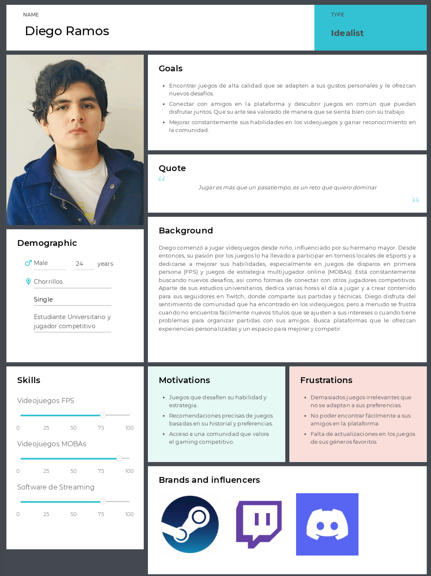
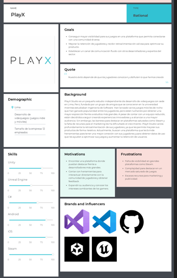
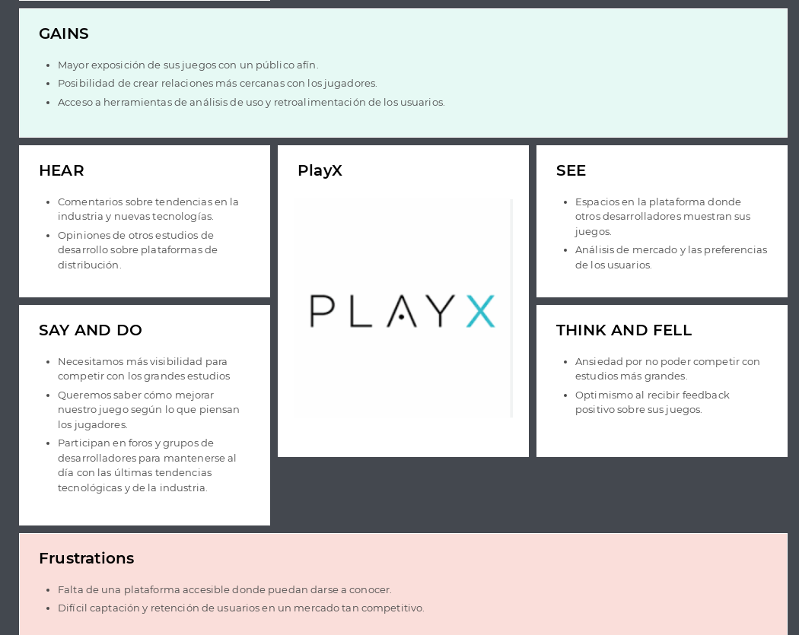

# Capítulo II: Requirements Elicitation & Analysis
## 2.1. Competidores.
### 2.1.1. Análisis competitivo.
<table>
  <tr>
    <th colspan="22">Competitive Analysis Landscape</th>
  </tr>
  <tr>
    <td colspan="1">¿Por qué llevar a cabo el análisis?</td>
    <td colspan="17">El análisis competitivo es esencial para entender el mercado, identificar oportunidades de diferenciación y anticipar amenazas. Permite ajustar la estrategia para ganar ventaja sobre la competencia y asegurar el éxito del producto.</td>
  </tr>
  <tr>
    <td colspan="2"></td>
    <td>Vortex </td>
    <td>Steam </td>
    <td>Itch.io </td>
    <td>Game Jolt </td>
</tr>
  <tr>
    <td rowspan="2">Perfil</td>
    <td>Overview</td>
    <td>Vortex es una plataforma emergente que conecta a los jugadores con juegos que coinciden con sus intereses, ofreciendo recomendaciones personalizadas, funciones sociales, y un espacio para desarrolladores para promocionar sus títulos a una audiencia apasionada.</td>
    <td>Steam es una plataforma de distribución de videojuegos que ofrece una extensa biblioteca de juegos, junto con características sociales, reseñas y contenido generado por los usuarios.</td>
    <td>Itch.io es una plataforma para juegos indie que permite a los desarrolladores vender y promocionar sus juegos directamente a los usuarios, ofreciendo opciones de precios flexibles.</td>
    <td>Game Jolt es una plataforma que permite a los desarrolladores indie compartir sus juegos gratuitamente o de pago, con una comunidad activa que incluye características sociales y de descubrimiento.</td>
</tr>
  <tr>
  <td>Ventaja competitiva ¿Qué valor ofrece a los clientes?</td>
    <td>Recomendaciones personalizadas, enfoque en el descubrimiento de juegos, herramientas sociales integradas, y opciones avanzadas mediante suscripción que mejoran la experiencia de los usuarios y desarrolladores.</td>
    <td>Biblioteca masiva, comunidad global, compatibilidad con mods, y ventas regulares que atraen a una gran audiencia.</td>
    <td>Plataforma amigable para los desarrolladores independientes con control total sobre el precio y el contenido.</td>
    <td>Enfoque en juegos indie con una fuerte comunidad social, permite a los desarrolladores interactuar directamente con los jugadores.</td>
  </tr>
<tr>
    <td rowspan="2">Perfil de Marketing</td>
    <td>Mercado Objetivo</td>
    <td>Jugadores que desean descubrir nuevos juegos que se alineen con sus gustos y desarrolladores que buscan llegar a audiencias específicas y apasionadas.</td>
    <td>Jugadores de PC que buscan una gran variedad de títulos, desde triple-A hasta indie, con características sociales y ofertas.</td>
    <td>Desarrolladores indie y jugadores interesados en títulos alternativos y experimentales.</td>
    <td>Desarrolladores indie y gamers que disfrutan de juegos experimentales y que buscan una comunidad social activa.</td>
  </tr>
  <tr>
  <td>Estrategias de Marketing</td>
    <td>Publicidad en línea, redes sociales, colaboraciones con desarrolladores, y contenido generado por los usuarios para promover el descubrimiento.</td>
    <td>Descuentos importantes, publicidad en medios, colaboraciones con desarrolladores.</td>
    <td>Estrategia centrada en la comunidad, marketing orgánico y promociones internas.</td>
    <td>Promoción a través de eventos comunitarios, contenido generado por los usuarios y campañas sociales.</td>
  </tr>
<tr>
    <td rowspan="3">Perfil de Producto</td>
    <td>Productos y Servicios</td>
    <td>Plataforma de descubrimiento de juegos con recomendaciones personalizadas, funciones sociales avanzadas, y herramientas para que los desarrolladores promocionen sus juegos directamente a los jugadores.</td>
    <td>Venta de juegos digitales, contenido generado por usuarios, soporte para mods, reseñas, y más.</td>
    <td>Venta directa de juegos indie, herramientas de promoción y precios flexibles.</td>
    <td>Comunidad activa que promueve juegos indie con herramientas para desarrolladores.</td>
  </tr>
  <tr>
  <td>Precios y Costos</td>
    <td>Suscripción mensual para características avanzadas, con acceso gratuito a las funciones básicas.</td>
    <td>Los precios varían según el juego; acceso gratuito a la plataforma.</td>
    <td>Los desarrolladores establecen los precios, algunos juegos son gratuitos.</td>
    <td>Juegos gratuitos o de pago; sin costo para unirse a la comunidad.</td>
  </tr>
<td>Canales de distribución (Web y/o Móvil)</td>
    <td>Web, cliente de escritorio (en desarrollo).</td>
    <td>Web, cliente de escritorio, aplicación móvil.</td>
    <td>Web, cliente de escritorio.</td>
    <td>Web, cliente de escritorio, móvil.</td>
<tr>
    <td rowspan="4">Análisis SWOT</td>
    <td>Fortalezas</td>
    <td>Enfoque en recomendaciones personalizadas, funciones sociales mejoradas, relación cercana con desarrolladores indie.</td>
    <td>Base de usuarios masiva, excelente infraestructura, gran biblioteca de juegos.</td>
    <td>Comunidad fuerte, flexibilidad en precios y distribución.</td>
    <td>Comunidad activa, soporte para desarrolladores indie, interacción directa entre jugadores y creadores.</td>
  </tr>
  <tr>
  <td>Debilidades</td>
    <td>Plataforma en etapa de crecimiento, con menos historial en comparación con competidores establecidos.</td>
    <td>Competencia feroz, saturación de contenido, dependencia de ventas masivas.</td>
    <td>Alcance limitado fuera del ámbito indie, dependencia de la comunidad para el crecimiento.</td>
    <td>Enfoque casi exclusivo en juegos indie, con menos exposición masiva.</td>
    </tr>
  <tr>
<td>Oportunidades</td>
    <td>Crecimiento en mercados emergentes, asociaciones con desarrolladores y publishers para promover el descubrimiento.</td>
    <td>Expansión a mercados móviles, mayor integración de realidad virtual.</td>
    <td>Expansión a más géneros y categorías, colaboraciones con desarrolladores.</td>
    <td>Potencial de monetización a través de nuevas características sociales y eventos comunitarios.</td>
</tr>
  <tr>
<td>Amenazas</td>
    <td>Competencia de grandes plataformas como Steam y Epic Games, que tienen mayor alcance y recursos.</td>
    <td>Nuevas plataformas de distribución que ofrecen menores comisiones.</td>
    <td>Falta de atención de grandes publishers, saturación del mercado indie.</td>
    <td>Desafíos para diferenciarse en un mercado competitivo dominado por grandes plataformas.</td>
</tr>
</table>

### 2.1.2. Estrategias y tácticas frente a competidores.
Para fortalecer nuestra posición en el mercado, Teemo Solutions se centrará en aprovechar sus fortalezas clave, como
la personalización de recomendaciones y la experiencia fluida en la plataforma Vortex, que permite a los jugadores 
descubrir nuevos títulos basados en sus intereses y conectar con otros jugadores de manera sencilla. Este enfoque nos 
permitirá diferenciarnos en un mercado competitivo, destacándonos como una plataforma integral tanto para jugadores como 
para desarrolladores de videojuegos. Además, buscaremos oportunidades de expansión mediante alianzas con estudios de desarrollo 
independientes, lo que no solo mejorará nuestra oferta de contenido, sino que también nos posicionará como un líder en 
innovación dentro del sector de los videojuegos.

Con lo que respecta a nuestras debilidades, como la etapa inicial de desarrollo y los recursos limitados frente a competidores más
grandes, adoptaremos un enfoque estratégico que incluya implementaciones piloto con estudios de juegos indie para demostrar 
el valor de Vortex antes de una expansión más amplia y dandole oportunidad de exponer ssus juegos a la audiencia. Esto nos 
permitirá mitigar riesgos y construir una base de confianza 
con nuestros primeros usuarios. Simultáneamente, abordaremos las amenazas del mercado, como la competencia de plataformas 
más establecidas, mediante estrategias de marketing enfocadas en destacar nuestra diferenciación y un enfoque constante 
en la seguridad y privacidad de los datos de los usuarios. Esto reforzará la confianza de nuestra audiencia y nos permitirá 
competir eficazmente frente a otras plataformas de descubrimiento de videojuegos.

## 2.2. Entrevistas.
### 2.2.1. Diseño de entrevistas.

#### Segmento Objetivo: Gamers Entusiastas
#### Datos demográficos:
- ¿Cuál es tu género?

- ¿Qué edad tienes?

- ¿En qué distrito resides?

- ¿Cuál es tu estado civil?
  
- ¿Tienes hijos o dependientes? Si es así, ¿cuántos?

- ¿Cuál es tu ocupación?

#### Intereses y motivaciones:

- ¿Qué factores influyen más en tu decisión de comprar o jugar un videojuego nuevo?

- ¿Qué características o funcionalidades te gustaría ver en una plataforma ideal para descubrir y conectar con videojuegos?

- ¿Qué papel juegan las comunidades online y las redes sociales en tu experiencia de juego?

- ¿Qué tipo de contenido o servicios adicionales estarías dispuesto a pagar en relación con los videojuegos?

- ¿Cuáles son tus principales frustraciones o desafíos al buscar y elegir nuevos videojuegos?

- ¿Qué importancia le das a las recomendaciones personalizadas y a la capacidad de conectar con otros jugadores con intereses similares?

- ¿Qué opinas sobre el modelo de suscripción en el contexto de los videojuegos y plataformas de juego?

- ¿Qué tendencias o innovaciones te gustaría ver en el futuro de la industria de los videojuegos?

#### Segmento Objetivo: Empresas Desarrolladoras de Videojuegos

#### Datos demográficos:

- ¿Cuál es tu género?

- ¿Qué edad tienes?

- ¿En qué distrito resides?

- ¿Cuál es tu estado civil?

- ¿Tienes hijos o dependientes? Si es así, ¿cuántos?

#### Desafíos y estrategias:

- ¿Cuáles son los mayores desafíos que enfrentan actualmente en la industria de los videojuegos?

- ¿Qué estrategias de marketing y promoción consideran más efectivas para llegar a su público objetivo?

- ¿Qué papel juegan las comunidades de jugadores y las redes sociales en su estrategia de marketing y desarrollo de videojuegos?

- ¿Qué tipo de datos o métricas consideran más valiosos para evaluar el éxito de sus videojuegos?

- ¿Qué características o funcionalidades buscan en una plataforma ideal para promocionar y distribuir sus videojuegos?

- ¿Qué opinan sobre el modelo de suscripción como una forma de monetización y distribución de videojuegos?

- ¿Qué tipo de colaboraciones o asociaciones buscan con otras empresas o plataformas en la industria de los videojuegos?

- ¿Qué tendencias o innovaciones creen que tendrán un mayor impacto en el futuro de la industria de los videojuegos?

### 2.2.2. Registro de entrevistas.

### Segmento objetivo: Gamers Entusiastas

### **Entrevista #1**  

**Nombre:** Bruno Chaud Carbajal 

**Género:** Hombre 

**Edad:** 24 años 

**Distrito de residencia:** Chorrillos 

**Estado civil:** Soltero 

**Familia:** No tiene hijos 

**Ocupación:** Estudiante universitario 

#### Imagen de referencia:
  
Inicio De Entrevista: 9:45 
Fin de la entrevista: 14:46  

#### ¿Qué factores influyen más en tu decisión de comprar o jugar un videojuego nuevo?

Como gamer apasionado, los factores clave incluyen la calidad gráfica, la jugabilidad, las reseñas de otros jugadores, la reputación del desarrollador, y si el juego tiene un componente competitivo o eSports. También es importante si el juego ofrece desafíos que puedan mantener su interés a largo plazo.

#### ¿Qué características o funcionalidades te gustaría ver en una plataforma ideal para descubrir y conectar con videojuegos?

Una plataforma ideal debería ofrecer recomendaciones personalizadas basadas en el historial de juego, la posibilidad de conectar con otros jugadores con intereses similares, acceso a torneos y competiciones, y una comunidad activa donde se puedan compartir estrategias y consejos.

#### ¿Qué papel juegan las comunidades online y las redes sociales en tu experiencia de juego?

Juegan un papel crucial. Las comunidades online son donde aprende nuevas estrategias, descubre juegos, se mantiene al día con las tendencias y participa en debates. Las redes sociales también son vitales para estar conectado con otros jugadores, seguir a streamers y participar en discusiones sobre juegos.

#### ¿Qué tipo de contenido o servicios adicionales estarías dispuesto a pagar en relación con los videojuegos?

Estaría dispuesto a pagar por contenidos adicionales como expansiones, skins, y contenido exclusivo en juegos. También valoraría servicios premium que ofrezcan acceso anticipado a juegos, análisis detallados, guías estratégicas, o incluso coaching personalizado en eSports.

#### ¿Cuáles son tus principales frustraciones o desafíos al buscar y elegir nuevos videojuegos?

Una de las principales frustraciones es la dificultad para encontrar juegos que realmente se alineen con sus intereses y estilo de juego, especialmente en un mercado saturado. Otro desafío es la falta de información fiable antes de hacer una compra, como reseñas que reflejen su perspectiva.

#### ¿Qué importancia le das a las recomendaciones personalizadas y a la capacidad de conectar con otros jugadores con intereses similares?

Las recomendaciones personalizadas son muy importantes, ya que ayudan a descubrir juegos que realmente valen la pena. La capacidad de conectar con otros jugadores con intereses similares es igualmente esencial, ya que enriquece la experiencia de juego y fomenta el aprendizaje y la mejora continua.

#### ¿Qué opinas sobre el modelo de suscripción en el contexto de los videojuegos y plataformas de juego?

Considera el modelo de suscripción atractivo, especialmente si ofrece acceso a una amplia biblioteca de juegos de calidad, descuentos exclusivos y otros beneficios. Sin embargo, la decisión de suscribirse depende de la calidad y cantidad de juegos disponibles en la plataforma.

#### ¿Qué tendencias o innovaciones te gustaría ver en el futuro de la industria de los videojuegos?

Le gustaría ver más avances en la realidad virtual y aumentada, juegos que integren mejor la inteligencia artificial para ofrecer experiencias más personalizadas y desafiantes, y un crecimiento en el ámbito de los eSports, con más oportunidades para jugadores profesionales.

### **Entrevista #2**  

**Género:** Masculino  

**Edad:** 23 años  

**Distrito:** San Isidro  

**Estado civil:** Soltero  

**Hijos o dependientes:** No tiene hijos  

**Ocupación:** Universitario  

#### Imagen de referencia:
    
  Inicio De Entrevista: 14:46  
  Fin de la entrevista: 21:14  

#### ¿Qué factores influyen más en tu decisión de comprar o jugar un videojuego nuevo?
Uno de los factores más importantes para mí al decidir comprar o jugar un nuevo videojuego es si mis amigos también lo están jugando. La experiencia de juego es mucho más divertida y social cuando puedo compartirla con personas que conozco.

#### ¿Qué características o funcionalidades te gustaría ver en una plataforma ideal para descubrir y conectar con videojuegos?
Me gustaría ver un sistema de recomendaciones robusto en una plataforma ideal, que me permita probar nuevos juegos que estén alineados con mis intereses. Este sistema debería sugerir juegos basados en lo que mis amigos están jugando o en lo que se comenta en las comunidades online.

#### ¿Qué papel juegan las comunidades online y las redes sociales en tu experiencia de juego?
Las comunidades online y las redes sociales juegan un papel crucial en mi experiencia de juego. A través de ellas, puedo leer comentarios y opiniones de otros jugadores, lo que me ayuda a decidir si un juego vale la pena o no. También son una excelente manera de conectarme con otros jugadores y formar equipos o participar en discusiones sobre estrategias.

#### ¿Qué tipo de contenido o servicios adicionales estarías dispuesto a pagar en relación con los videojuegos?
Estoy dispuesto a pagar por servicios como el GamePass de Xbox, ya que considero que ofrece una excelente relación calidad-precio. Me permite acceder a una gran cantidad de juegos, disfrutar del modo multijugador, y personalizar mi experiencia con skins y otros complementos.

#### ¿Cuáles son tus principales frustraciones o desafíos al buscar y elegir nuevos videojuegos?
Una de mis principales frustraciones es cuando compro un juego junto con mis amigos, pero ellos pierden interés rápidamente y dejan de jugar al día siguiente. Esto me deja sin compañía para disfrutar del juego, lo cual disminuye mi motivación para seguir jugando.

#### ¿Qué importancia le das a las recomendaciones personalizadas y a la capacidad de conectar con otros jugadores con intereses similares?
Le doy mucha importancia a las recomendaciones personalizadas y a la capacidad de conectar con otros jugadores que comparten mis intereses. Es crucial poder descubrir juegos que mis amigos ya están disfrutando y que podríamos jugar juntos, creando una experiencia más social y divertida.

#### ¿Qué opinas sobre el modelo de suscripción en el contexto de los videojuegos y plataformas de juego?
Creo que el modelo de suscripción es una excelente oportunidad para aprovechar una gran cantidad de juegos a un precio razonable. Permite acceder a una variedad de títulos sin tener que comprarlos individualmente, lo cual es especialmente útil para un jugador como yo que disfruta explorando diferentes géneros y estilos de juego.

#### ¿Qué tendencias o innovaciones te gustaría ver en el futuro de la industria de los videojuegos?
Me gustaría ver una tendencia hacia la normalización de los videojuegos como un pasatiempo accesible para cualquier persona, similar a cómo se percibe el streaming de series y películas en plataformas como Netflix. Esto ayudaría a eliminar el estigma de los videojuegos y permitiría que más personas disfruten de este medio de entretenimiento.

### **Entrevista #3**  

**Género:** Masculino  

**Edad:** 19 años  

**Distrito:** Barranco  

**Estado civil:** Soltero  

**Hijos o dependientes:** No tiene hijos 

**Ocupación:** Estudiante universitario de Ingeniería de Software y gamer profesional en diversos videojuegos

#### Imagen de referencia:
  
Inicio De Entrevista: 21:14  
Fin de la entrevista: 27:06  

### Intereses y Motivaciones

#### ¿Qué factores influyen más en tu decisión de comprar o jugar un videojuego nuevo?  
Mi principal motivación para elegir un videojuego es su relevancia en el ámbito competitivo, especialmente en los shooters, ya que estos juegos son mi fuente de ingresos. También considero la opinión de la comunidad sobre el juego, buscando que esté alineada con mis preferencias y que las especificaciones técnicas cumplan con los estándares requeridos para un rendimiento óptimo.

#### ¿Qué características o funcionalidades te gustaría ver en una plataforma ideal para descubrir y conectar con videojuegos?  
Una plataforma ideal debería conocer a fondo mis gustos y ofrecer recomendaciones alineadas tanto con mis intereses personales como con los de mis amigos. Me gustaría ver ofertas de videojuegos en mi feed que se ajusten a mi perfil y permitan una mejor experiencia de compra y descubrimiento.

#### ¿Qué papel juegan las comunidades online y las redes sociales en tu experiencia de juego?  
Las comunidades online y las redes sociales juegan un rol fundamental en mi experiencia de juego, especialmente en el ámbito profesional de los shooters. La interacción constante con otros jugadores es crucial para el desarrollo de estrategias y el fortalecimiento de la comunidad. Además, utilizo las redes sociales para mantenerme informado sobre noticias y ofertas relevantes.

#### ¿Qué tipo de contenido o servicios adicionales estarías dispuesto a pagar en relación con los videojuegos?  
Considero que pagar una suscripción para probar diferentes videojuegos es una opción valiosa, siempre y cuando se ofrezca la flexibilidad de cancelar el servicio cuando no sea necesario. Este modelo me permite explorar varios juegos sin comprometerme a compras individuales.

#### ¿Cuáles son tus principales frustraciones o desafíos al buscar y elegir nuevos videojuegos?  
Mis principales frustraciones radican en la falta de atractivo de ciertas comunidades; si una comunidad no es activa o atractiva, el videojuego también pierde interés para mí. Asimismo, las malas reseñas pueden ser un obstáculo importante que me desmotiva a probar nuevos títulos.

#### ¿Qué importancia le das a las recomendaciones personalizadas y a la capacidad de conectar con otros jugadores con intereses similares?  
Doy mucha importancia a las recomendaciones personalizadas, especialmente cuando me ayudan a descubrir juegos más allá de los típicos títulos triple A. Los juegos indie o menos conocidos a menudo carecen de visibilidad en otras plataformas, por lo que una mayor exposición en las recomendaciones sería muy beneficiosa.

#### ¿Qué opinas sobre el modelo de suscripción en el contexto de los videojuegos y plataformas de juego?  
El modelo de suscripción es una excelente opción, ya que permite disfrutar de una amplia variedad de contenido sin comprometerse a largo plazo. Esto genera confianza hacia la empresa y da acceso a un entretenimiento variado que se adapta a las preferencias del usuario.

#### ¿Qué tendencias o innovaciones te gustaría ver en el futuro de la industria de los videojuegos?  
Estoy interesado en ver cómo avanza la realidad virtual y cómo puede revolucionar la experiencia de juego. Además, creo que es esencial promover una mayor libertad en la comunicación y la expresión dentro de los videojuegos, permitiendo una interacción más auténtica y dinámica entre los jugadores.
 

### 2.2.3. Análisis de entrevistas.
## 2.3. Needfinding.
### 2.3.1. User Personas.
En esta sección, presentaremos el perfil de nuestros User Persona, que surge de un análisis de las entrevistas realizadas anteriormente y de una evaluación de la competencia en el mercado. Los artefactos que vamos a presentar están estrechamente relacionados con las principales características identificadas durante este proceso de análisis. Desde las entrevistas, hemos extraído valiosa información sobre las necesidades, deseos y frustraciones de nuestros potenciales usuarios, lo que nos ha permitido perfilar a nuestro User Persona de manera precisa y realista.

- **User Persona Primer Segmento Objetivo(Gamers Entusiastas)**
  
- **User Persona Segundo Segmento Objetivo(Empresa desarrolladora de Videojuegos)**
  

### 2.3.2. User Task Matrix.

En esta sección se presenta el **User Task Matrix**, que detalla las tareas que los **User Personas** realizan para alcanzar sus objetivos. Los segmentos considerados son:

1. **Gamer Entusiasta**: Representado por Diego Ramos, un gamer competitivo que busca desafíos constantes y conexión con otros jugadores.
2. **Empresa Desarrolladora de Videojuegos (Pequeña/Mediana Empresa)**: Representado por PlayX Studio, un estudio indie que busca mayor visibilidad y retroalimentación de los jugadores.

El cuadro a continuación incluye como columnas a los **User Personas**, desglosados en sub-columnas de Frecuencia e Importancia, donde se especifica cómo cada tarea contribuye a sus objetivos generales.

| **Tareas**                                           | **Gamer Entusiasta**       |                          | **Empresa Desarrolladora** |                          |
|------------------------------------------------------|----------------------------|--------------------------|----------------------------|--------------------------|
|                                                      | **Frecuencia**             | **Importancia**           | **Frecuencia**             | **Importancia**           |
| **Buscar nuevos juegos que coincidan con sus gustos** | Alta                       | Muy Alta                  | Media                      | Alta                      |
| **Conectar con amigos en la plataforma**             | Alta                       | Muy Alta                  | Baja                       | Media                     |
| **Participar en comunidades de gaming**              | Media                      | Alta                      | Baja                       | Media                     |
| **Seguir y participar en torneos de eSports**        | Alta                       | Alta                      | Baja                       | Media                     |
| **Probar juegos nuevos o prototipos**                | Media                      | Media                     | Alta                       | Alta                      |
| **Obtener retroalimentación de los jugadores**       | Baja                       | Media                     | Muy Alta                   | Muy Alta                  |
| **Publicar actualizaciones de sus juegos**           | Baja                       | Baja                      | Alta                       | Muy Alta                  |
| **Establecer conexiones con otros desarrolladores**  | Baja                       | Media                     | Alta                       | Alta                      |
| **Analizar tendencias y preferencias del mercado**   | Media                      | Alta                      | Muy Alta                   | Muy Alta                  |
| **Optimizar el rendimiento de sus juegos**           | Baja                       | Media                     | Alta                       | Muy Alta                  |

## Análisis

### Tareas con mayor frecuencia e importancia:

- Para el **Gamer Entusiasta**, las tareas con **mayor frecuencia e importancia** son buscar nuevos juegos que coincidan con sus gustos y conectar con amigos en la plataforma. Esto refleja su necesidad de encontrar contenido relevante y una experiencia social significativa a través de la plataforma.
- Para la **Empresa Desarrolladora**, las tareas más **frecuentes e importantes** incluyen obtener retroalimentación de los jugadores y publicar actualizaciones de sus juegos. Esto destaca su enfoque en mejorar continuamente sus productos y en mantenerse conectados con su audiencia.

### Principales diferencias:

- El **Gamer Entusiasta** realiza tareas más relacionadas con el disfrute de los juegos y la interacción social, como participar en torneos de eSports y comunidades de gaming, mientras que la **Empresa Desarrolladora** se concentra en la creación de contenido, con un enfoque en la visibilidad y la mejora de sus juegos.
- La **frecuencia** de tareas relacionadas con el análisis de mercado y la optimización del rendimiento de los juegos es mayor para la **Empresa Desarrolladora**, dado que su éxito depende de comprender mejor a los usuarios y ajustar sus productos en consecuencia. Por el contrario, el **Gamer Entusiasta** se enfoca más en experiencias inmediatas y personales.

### Coincidencias:

- Ambas personas valoran el acceso a **nuevos juegos** y la posibilidad de probar **nuevas experiencias**, aunque lo hacen con diferentes enfoques. El **Gamer Entusiasta** busca juegos ajustados a sus intereses, mientras que la **Empresa Desarrolladora** está interesada en que sus juegos lleguen a más personas para recibir retroalimentación valiosa.
- Ambos segmentos buscan oportunidades para **conectar con otros** en la plataforma, aunque lo hacen por diferentes motivos. El **Gamer Entusiasta** lo hace para jugar con amigos, mientras que la **Empresa Desarrolladora** lo hace para construir relaciones dentro de la industria.

Este análisis permite comprender mejor las tareas clave que realizan los diferentes usuarios y cómo la plataforma puede satisfacer sus necesidades específicas. La solución deberá priorizar la personalización para los gamers y proporcionar herramientas efectivas de visibilidad y feedback para los desarrolladores.

### 2.3.3. User Journey Mapping.

El siguiente mapa ilustra los recorridos actuales (As-Is) de dos tipos de usuarios clave: Gamer Entusiasta y Empresa Desarrolladora de Videojuegos. Cada User Journey muestra cómo interactúan estos usuarios con los juegos o plataformas existentes y los desafíos que enfrentan, desde el descubrimiento hasta el abandono o la continuidad de su uso. Estos journeys son esenciales para identificar áreas clave de oportunidad que nuestra plataforma buscará mejorar.

**Segmento Objetivo: Gamers Entusiastas**  

**Segmento Objetivo: Empresa desarrolladora de Videojuegos**  

### 2.3.4. Empathy Mapping.

- **Empathy Map Primer Segmento Objetivo(Gamers Entusiastas)**
  
- **Empathy Map Segundo Segmento Objetivo(Empresa desarrolladora de Videojuegos)**
  
  
### 2.3.5. As-is Scenario Mapping.

- As-Is del segmento objetivo Gamers Entusiastas:

- As-Is del segmento objetivo Empresa desarrolladora de Videojuegos:

## 2.4. Ubiquitous Language.
El "Lenguaje Ubicuo" de Vortex permitirá establecer un vocabulario común entre el equipo de desarrollo y los usuarios, facilitando la comprensión y comunicación de los conceptos clave relacionados con la recomendación de videojuegos y la interacción social dentro de la plataforma.
  
**Videojuego:** Producto de entretenimiento digital que puede ser recomendado, agregado a una lista de favoritos, o subido por un desarrollador a la plataforma Vortex.
  
**Desarrollador:** Usuario de Vortex que crea y publica videojuegos en la plataforma. Los desarrolladores pueden gestionar los videojuegos que suben, interactuar con otros desarrolladores y jugadores, y obtener métricas de popularidad.
  
**Jugador:** Usuario de Vortex que utiliza la plataforma para recibir recomendaciones personalizadas de videojuegos, agregar amigos, ver los videojuegos que sus amigos juegan y agregar títulos a su lista de favoritos.
  
**Recomendación de Videojuegos:** Funcionalidad de Vortex que sugiere videojuegos a los jugadores, basándose en sus preferencias personales, historial de juegos, y las recomendaciones relacionadas con los gustos de sus amigos.
  
**Lista de Favoritos:** Colección personalizada de videojuegos que un jugador marca como favoritos, permitiendo un acceso rápido y fácil a los títulos que le interesan o que desea recordar.
  
**Amigo:** Otro usuario de Vortex con el cual un jugador ha establecido una conexión dentro de la plataforma. Los amigos pueden compartir sus listas de juegos, ver las recomendaciones entre sí y mantenerse al día sobre sus actividades relacionadas con videojuegos.
  
**Perfil de Jugador:** Información relacionada con un jugador en Vortex, que incluye su historial de juegos, preferencias, lista de amigos, y lista de videojuegos favoritos. El perfil también permite personalizar las recomendaciones que recibe.
  
**Publicar Videojuego:** Acción disponible para los desarrolladores, que les permite subir sus videojuegos a la plataforma Vortex, haciéndolos accesibles para los jugadores y ofreciendo la posibilidad de recibir recomendaciones a otros usuarios.
  
**Métricas de Videojuegos:** Herramienta que proporciona a los desarrolladores estadísticas sobre el rendimiento de sus videojuegos en Vortex, como la cantidad de jugadores, calificaciones y popularidad dentro de la plataforma.
  
**Plan para Desarrolladores:** Nivel de suscripción que permite a los desarrolladores subir videojuegos a la plataforma, administrar su contenido, y acceder a métricas avanzadas de desempeño.
  
**Plan para Jugadores:** Nivel de suscripción que ofrece a los jugadores la posibilidad de agregar amigos, recibir recomendaciones de videojuegos, crear listas de favoritos, y disfrutar de una experiencia personalizada basada en sus gustos y los de sus amigos.
  
**Algoritmo de Recomendación:** Motor detrás de Vortex que analiza los gustos de los jugadores y sus amigos para generar recomendaciones de videojuegos. Este algoritmo se ajusta según las interacciones del jugador en la plataforma.
  
**Juego Relacionado:** Videojuego que el sistema de Vortex sugiere a un jugador, basado en los videojuegos que ha jugado previamente o que se encuentran en la lista de favoritos de sus amigos.
  
**Reseña de Videojuego:** Opinión escrita por un jugador sobre un videojuego, que puede ser visible para otros jugadores de la plataforma y ayudar a influir en las recomendaciones y decisiones de compra.
  

