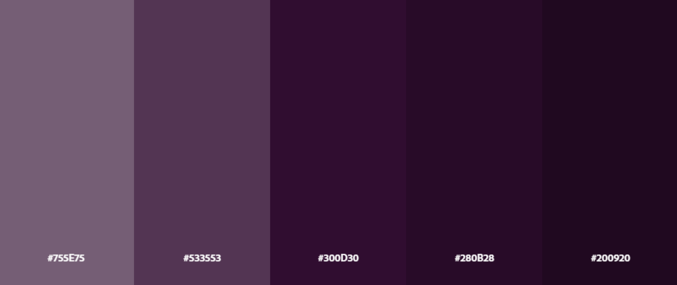
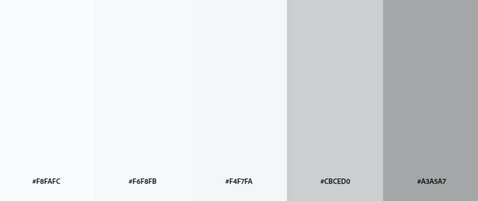
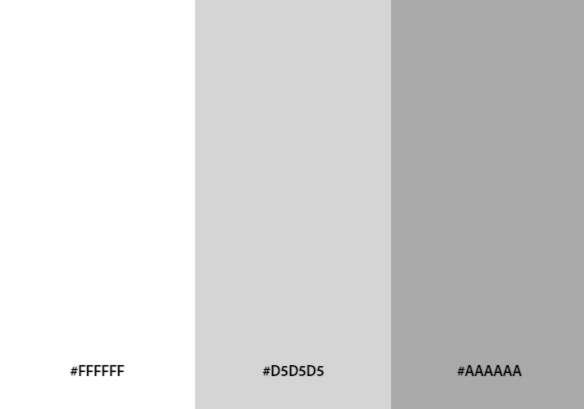
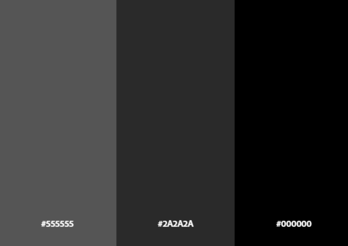

# **CAPÍTULO IV: PRODUCT DESIGN**
## 4.1. Style Guidelines
En esta sección, presentaremos el concepto de diseño para la página web y la aplicación, para proporcionar a nuestros usuarios una interfaz amigable y funcional. Con este propósito en mente, hemos optado por utilizar elementos visuales que sean fáciles de percibir y que resulten atractivos a la vista.

### 4.1.1. General Style Guidelines
La paleta de colores seleccionada para la plataforma se ha diseñado con el objetivo de lograr un equilibrio visual que transmita modernidad, profesionalismo y claridad en la interfaz. Se utiliza una combinación de colores cromáticos y acromáticos para establecer una jerarquía visual coherente, enfocada en mejorar la experiencia del usuario y la legibilidad.

**Chromatic Colors:**

#300D30 (Violeta Oscuro): Este tono profundo y elegante se utiliza para destacar elementos clave, como botones importantes o encabezados, proporcionando un contraste visual que guía la atención del usuario de manera efectiva.   

  

**Achromatic Colors:**

#F4F7FA (Gris muy claro): Este color se emplea como fondo principal para áreas extensas, ofreciendo una base neutra y suave que no cansa la vista, manteniendo una atmósfera limpia y ligera.

  

#FFFFFF (Blanco puro): Se utiliza en secciones que requieren máxima claridad, como el fondo de textos o formularios, asegurando una legibilidad óptima y una presentación pulida.

  

#000000 (Negro): Aplicado para textos o iconos en áreas donde el contraste es crucial para la lectura, especialmente en textos sobre fondos claros.

  

### 4.1.2. Web Style Guidelines
**Typography: DM Sans**

La tipografía principal utilizada será DM Sans, seleccionada por su simplicidad, legibilidad y modernidad. Asegura una experiencia de lectura clara tanto en pantallas pequeñas como grandes, lo que la hace ideal para la interfaz de nuestra plataforma de videojuegos.

Este enfoque asegura que se respeten los principios de diseño modernos y que el estilo tipográfico sea consistente en toda la aplicación.

**Icon:**

Nuestro logo está inspirado en el concepto de vortex, en línea con la temática espacial de la plataforma. Representa un remolino dinámico, evocando movimiento y descubrimiento. El color predominante del logo es el violeta, que es nuestro color principal y representativo, simbolizando creatividad y misterio, mientras mantiene una conexión visual con el espacio y la tecnología.

  
  
  

Este enfoque resalta la identidad visual del logo y su conexión con la temática del proyecto.

## 4.2. Information Architecture

La arquitectura de la información de nuestra plataforma establece la estructura y organización de todos los elementos clave, facilitando la navegación eficiente y la experiencia de usuario. Está diseñada para asegurar que los usuarios, tanto desarrolladores como gamers, puedan acceder de manera intuitiva a las funcionalidades principales, como la creación de perfiles, recomendaciones personalizadas, y promoción de videojuegos. La jerarquía de información y los flujos de navegación están optimizados para una interacción fluida, asegurando que cada usuario encuentre lo que busca rápidamente y sin complicaciones.

Como equipo, hemos decidido implementar los patrones de diseño Z y F para optimizar la experiencia del usuario en la plataforma. Estos patrones son conocidos por guiar la vista del usuario de manera eficiente a través del contenido clave. Además, hemos asegurado que la plataforma sea completamente responsive, lo que significa que ofrecerá una experiencia óptima en dispositivos de diferentes tamaños, desde móviles hasta pantallas de escritorio.### 4.2.1. Organization Systems

### 4.2.2. Labeling Systems
**Menú Principal: Home**

1. Home: Punto de inicio para los usuarios, donde podrán acceder a recomendaciones personalizadas y noticias relevantes de la industria de videojuegos.
2. About us: Información sobre la misión y visión de Vortex, los servicios que ofrecemos, y la historia detrás del proyecto.
3. Subscriptions: Sección dedicada a las diferentes opciones de suscripción, ofreciendo a los usuarios acceso a características premium.
4. Comunidad: Espacio donde los usuarios pueden interactuar, compartir experiencias y recomendaciones de videojuegos.
5. Testimonios: Opiniones y reseñas de usuarios y empresas desarrolladoras sobre el impacto de Vortex en su experiencia.
6. Contact: Información de contacto para asistencia, soporte técnico y consultas generales.
7. Login: Para acceder al perfil del usuario y sus funciones personalizadas.

Las secciones Comunidad y About Us contarán con menús desplegables, lo que permitirá a los usuarios acceder a subcategorías y explorar contenido adicional de manera más organizada y eficiente. Esto contribuirá a mejorar la navegación dentro de la plataforma, facilitando una experiencia más intuitiva.

1. **Home:**
   La página principal será el punto de partida de los usuarios, brindando acceso directo a las secciones más importantes de la plataforma, con un diseño enfocado en la accesibilidad y claridad de la información. Aquí se destacarán los juegos recomendados, las novedades, y cualquier anuncio relevante para los gamers y desarrolladores.
     
2. **About Us:**
   Esta sección contará con un menú desplegable que incluirá diferentes subsecciones, tales como la historia de Vortex, la misión y visión de la plataforma, así como el equipo detrás del proyecto. La intención es que los usuarios puedan conocer en detalle el propósito de la plataforma y a las personas que la han hecho posible.
     
3. **Subscriptions:**
   En esta sección se ofrecerán diferentes planes de suscripción para acceder a funcionalidades avanzadas, como recomendaciones más precisas, conexión ilimitada con otros gamers, y acceso a juegos exclusivos. Se presentarán de forma clara las diferencias entre los tipos de suscripciones disponibles y sus beneficios.
     
4. **Comunidad:**
   La sección de Comunidad incluirá un menú desplegable que permitirá a los usuarios acceder a distintas subcategorías como foros, grupos de discusión, eventos organizados por la comunidad, y noticias sobre la industria de los videojuegos. Este espacio será clave para fomentar la interacción y la colaboración entre gamers y desarrolladores.
     
5. **Testimonios:**
   Aquí los usuarios podrán ver reseñas y testimonios de otros gamers y desarrolladores que han utilizado la plataforma. Será una herramienta útil para crear confianza en los nuevos usuarios y destacar la experiencia positiva de la comunidad.
     
6. **Contact:**
   La sección de Contact permitirá a los usuarios ponerse en contacto con el equipo de soporte de la plataforma, ya sea para resolver dudas, sugerir mejoras o reportar problemas. Incluirá un formulario de contacto y posiblemente un chatbot para asistencia rápida.
  
7. **Login:**
   El Login será el acceso a los perfiles de usuario, permitiendo a los gamers y desarrolladores iniciar sesión, crear cuentas nuevas, o recuperar credenciales. Una vez logueados, los usuarios tendrán acceso a sus recomendaciones personalizadas, listas de amigos y gestión de su suscripción.

**Consideraciones a Implementar:**
1. **Novedades:** Es esencial incluir una sección dedicada a Novedades, donde los usuarios puedan descubrir los juegos más recientes que han sido lanzados en la plataforma. Esta sección destacará juegos populares, nuevos lanzamientos y actualizaciones de títulos ya disponibles.
2. **Tienda:** La implementación de una Tienda será clave para permitir la compra de juegos directamente desde la plataforma. Los desarrolladores podrán ofrecer sus títulos a los gamers, quienes podrán adquirirlos utilizando diferentes métodos de pago. Esto no solo proporcionará una nueva fuente de ingresos para los desarrolladores, sino que también facilitará a los usuarios el acceso a nuevos juegos sin salir de la plataforma. Además, se podrían ofrecer ofertas exclusivas y descuentos para aquellos que tengan suscripciones avanzadas.
3. **Sistema de Puntos**: Para incentivar la participación y fidelización de los usuarios, se debería considerar la implementación de un Sistema de Puntos propio de la plataforma. Los gamers podrían acumular puntos al completar ciertas acciones como recomendar juegos, escribir reseñas, o participar en eventos de la comunidad. Estos puntos podrían ser canjeables por descuentos en la tienda, acceso anticipado a ciertos juegos o contenidos exclusivos, mejorando la experiencia del usuario y fomentando la permanencia en la plataforma.

**Otras Funcionalidades (Posible Expansión):**

Cambio de Perfil: Los usuarios podrán actualizar su información personal, foto de perfil y preferencias desde un panel de configuración fácil de usar.

Manejo de Configuraciones: La plataforma permitirá ajustar configuraciones como el idioma de la interfaz y el fondo del perfil para personalizar la experiencia del usuario de acuerdo con sus preferencias.

Además, se contará con una barra de navegación en todo momento en la parte superior de la página. Además de tener un Botón en el lado derecho. Con la finalidad de ayudar al usuario a ir de manera más rápida a la parte superior de la página.

### 4.2.3. SEO Tags and Meta Tags
En esta sección, abordaremos la implementación de SEO tags y meta tags para optimizar la visibilidad y el rendimiento de nuestra plataforma en los motores de búsqueda. Estas etiquetas son fundamentales para mejorar el posicionamiento de nuestro sitio web, asegurando que los usuarios puedan encontrar fácilmente nuestra plataforma y acceder a su contenido relevante. Exploraremos las mejores prácticas para la inclusión de estas etiquetas en nuestro HTML para maximizar el impacto en el SEO.

    <!DOCTYPE html>: Declara el tipo de documento y la versión de HTML.

    <html>: Elemento raíz del documento HTML. Contiene todos los demás elementos HTML.

    <head>: Contiene metadatos sobre el documento HTML, como el título, enlaces a hojas de estilo, y scripts.

    <meta charset="UTF-8">: Especifica la codificación de caracteres del documento.
    
    <title>: Define el título del documento, que aparece en la pestaña del navegador.
    
    <meta name="description" content="" />: Proporciona una descripción del contenido del documento para motores de búsqueda.
    
    <meta name="viewport" content="width=device-width, initial-scale=1" />: Configura la visualización del documento en dispositivos móviles.
    
    <link rel="shortcut icon" type="image/x-icon" href="assets/images/logo/vortex_icon.svg" />: Define el icono de la pestaña del navegador.
    
    <link rel="stylesheet" href="assets/css/bootstrap.min.css" />: Enlaza a una hoja de estilo CSS para el marco de trabajo Bootstrap.
    
    <link rel="stylesheet" href="assets/css/main.css" />: Enlaza a la hoja de estilo CSS principal.
    
    <link rel="stylesheet" href="assets/css/glightbox.min.css" />: Enlaza a una hoja de estilo CSS para GLightbox.
    
    <link rel="stylesheet" href="assets/css/LineIcons.3.0.css" />: Enlaza a una hoja de estilo CSS para los íconos de LineIcons.
    
    <link rel="stylesheet" href="assets/css/tiny-slider.css" />: Enlaza a una hoja de estilo CSS para Tiny Slider.
    
    <body>: Contiene el contenido visible del documento HTML.
    
    
: Contiene el diseño del preloader (pantalla de carga).
    
    <header class="header navbar-area">: Define la sección del encabezado del sitio, que incluye la barra de navegación.
    
    <nav class="navbar navbar-expand-lg">: Define la barra de navegación principal.
    
    <a class="navbar-brand" href="index.html">: Enlace al logotipo o nombre de la marca.
    
    <button class="navbar-toggler mobile-menu-btn": Botón para alternar el menú en dispositivos móviles.
    
    
: Contiene el menú de navegación desplegable.
    
    <ul id="nav" class="navbar-nav ms-auto">: Lista de elementos de navegación.
    
    <li class="nav-item">: Elemento de la lista de navegación.
    
    <a href="index.html" class="active">: Enlace de navegación para la página de inicio.
    
    <section class="hero-area">: Sección para el área principal de bienvenida (hero section).
    
    <h4> y <h1>: Encabezados de la sección principal.
    
    
: Párrafo de texto.
    
    
: Botón de llamada a la acción.

    
: Contenedor principal para el contenido de la sección.

    
: Título de la sección.

    <h3 class="wow zoomIn" data-wow-delay=".2s"> text here </h3>: Subtítulo que presenta la sección.

    <h2 class="wow fadeInUp" data-wow-delay=".4s"> text here </h2>: Título principal de la sección.

    
 text here 
: Descripción de la sección.

    <section id="aboutus" class="freatures section">: Sección para información sobre la empresa.
    
    
: Contiene características individuales.
    
    <i class="lni lni-dashboard"></i>: Icono de la característica.
    
    
: Sección de servicios ofrecidos.
    
    
: Servicio individual.
    
    <section id="pricing" class="pricing-table section">: Sección para las tablas de precios.
    
    
: Tabla de precios individual.
    
    <ul class="table-list">: Lista de características de la tabla de precios.
    
    <section class="intro-video-area section">: Sección dedicada al video introductorio.

    
: Contenedor principal para el contenido de la sección.

    
: Contiene el encabezado y el contenido principal de la sección.

    
: Contenedor para el área de reproducción del video.

    
: Contenedor para la miniatura de reproducción del video.

    <a src="https://www.youtube.com/embed/hvuojhm02Yk?si=Wu4NtzaLSxQ_w6wH" class="glightbox video"><i class="lni lni-play"></i></a>: Enlace para reproducir el video en YouTube.

    <section id="team" class="team section">: Sección dedicada al equipo.

    
: Contenedor para un miembro del equipo.

    
: Contenedor para la imagen del miembro del equipo.

    <section id="testimonial" class="testimonials style2 section">: Sección dedicada a los testimonios de clientes.
    
    
: Contenedor para el slider de testimonios.
    
    
: Columna que contiene un testimonio individual.
    
    
: Contenedor para un testimonio individual.
    
    
: Contenedor para el contenido interno del testimonio.
    
    
: Contenedor para el texto del testimonio.
     
    
: Contenedor para la información del autor del testimonio.

    
: Contenedor para el contenido interno del testimonio.

De la misma manera se consideran más secciones. Podemos identificar algunas etiquetas principales y que normalmente usamos en nuestra estructura HTML:

    <section class="hero-area">: Sección para el área principal de bienvenida (hero section).

    <h4> y <h1>: Encabezados de la sección principal.
    
    
: Párrafo de texto.
    
    
: Botón de llamada a la acción.

    
: Contenedor principal para el contenido de la sección.

    
: Título de la sección.

    <h3 class="wow zoomIn" data-wow-delay=".2s"> text here </h3>: Subtítulo que presenta la sección.

    <h2 class="wow fadeInUp" data-wow-delay=".4s"> text here </h2>: Título principal de la sección.

    
 text here 
: Descripción de la sección.

### 4.2.4. Searching Systems
Para el sistema de recomendación de videojuegos Vortex, el Searching Systems se refiere a la funcionalidad y la estructura para buscar y filtrar contenido en la plataforma.

### 4.2.5. Navigation Systems
**Estructura de Navegación:**
* Home
* About Us (Menú desplegable: About Us y Team) 
* Subscriptions
* Community (Menú desplegable: Blog y Testimonials) por expandir.
* Login

## 4.3. Landing Page UI Design
En esta sección, detallaremos las mejores prácticas y los elementos de diseño que se han implementado para lograr una landing page efectiva y visualmente atractiva para Vortex.
### 4.3.1. Landing Page Wireframe
En esta sección, exploraremos el wireframe de la Landing Page para Vortex, que sirve como una guía para el desarrollo y diseño visual posterior. El wireframe incluye elementos clave como la ubicación del encabezado, la navegación, las secciones principales de contenido, las llamadas a la acción y el pie de página. Además, se identifican las áreas destinadas a destacar características importantes, testimonios, y opciones de suscripción.

El propósito de este wireframe es asegurar que la disposición de los elementos sea funcional y que cumpla con los objetivos del sitio web, facilitando una navegación intuitiva y una experiencia de usuario eficiente. La revisión y aprobación de este wireframe es un paso esencial antes de avanzar hacia el diseño detallado y la implementación final de la Landing Page.

Landing Page para Desktop Web Browser

  

Landing Page para Mobile Web Browser

  

[Enlace del Figma de Teemo Solutions](https://www.figma.com/design/lvYMnoBHlze4kblrXJxKsc/Figma-Teemo-Solutions?node-id=0-1&t=jXqL7Xh7FqLBuM6V-1)

### 4.3.2. Landing Page Mock-up
En esta sección, presentaremos el mock-up de la Landing Page para Vortex, reflejando cómo se integrarán los elementos visuales y el contenido definido en el wireframe. Este diseño detallado incluye la aplicación de la identidad visual de la marca, como el logotipo, esquemas de color, imágenes, iconografía y estilos tipográficos. También se incorporan los detalles interactivos, como botones, enlaces y formularios, para ofrecer una experiencia de usuario más completa y envolvente.

Landing Page para Desktop Web Browser

[Enlace del Figma de Teemo Solutions](https://www.figma.com/design/lvYMnoBHlze4kblrXJxKsc/Figma-Teemo-Solutions?node-id=0-1&t=jXqL7Xh7FqLBuM6V-1)

Landing Page para Mobile Web Browser
## 4.4. Web Applications UX/UI Design
### 4.4.1. Web Applications Wireframes
### 4.4.2. Web Applications Wireflow Diagrams
### 4.4.3. Web Applications Mock-ups
### 4.4.4. Web Applications User Flow Diagrams
## 4.5. Web Applications Prototyping
## 4.6. Domain-Driven Software Architecture
### 4.6.1. Software Architecture Context Diagram
### 4.6.2. Software Architecture Container Diagrams
### 4.6.3. Software Architecture Components Diagrams
## 4.7. Software Object-Oriented Design
   ### 4.7.1. Class Diagrams

Se presenta el diagrama de clases que ilustra la arquitectura del sistema para el proyecto Vortex. Este incluye:

Clases: Definiciones de las entidades principales del sistema, incluyendo sus atributos (datos) y métodos (funciones o procedimientos).

Relaciones: Cómo las clases interactúan entre sí, mostrando asociaciones, herencias y dependencias.

Atributos y Métodos: Información detallada sobre los datos que cada clase maneja y las operaciones que puede realizar.

Visibilidad: La accesibilidad de los atributos y métodos, especificando si son públicos, privados o protegidos.

[Enlace del Diagrama de Clases](https://lucid.app/lucidchart/7edbb6f6-7003-4684-bb9d-f62fd45e1e61/edit?view_items=PLa-FQ270MDN&invitationId=inv_a15098d6-839d-41bd-aee2-a45db8d1b6ad)
### 4.7.2. Class Dictionary
## 4.8. Database Design
### 4.8.1. Database Diagram